# Project Aeris — Master Entity Relationship Diagram (Master ERD)

## 1. System Overview & Architecture Mapping

Project Aeris manages data using an embedded SQLite/bbolt engine with system catalogs stored in `_system.db`. All entities below represent the unified relational schema that powers the DBMS runtime, API routing, UI state, background workers, security policies, and telemetry.

### Core Schema Domains:
- **System Core & DB Registry (F3):** Multi-tenant databases (`databases`, `database_files`, `memory_databases`, `connection_pool_stats`, `plugins_registry`).
- **Security & Access Control (F4):** Users, RBAC, stateful sessions, and brute-force defenses (`users`, `roles`, `permissions`, `user_roles`, `role_permissions`, `_system_sessions`, `session_tokens`, `login_attempts`).
- **Catalog & Schema Engine (F2):** Tables, columns, indexes, foreign keys, and DDL operations (`tables_metadata`, `columns_metadata`, `indexes_metadata`, `foreign_keys`, `import_jobs`, `export_jobs`).
- **Query Engine & History (F1):** Executed query history, saved query books, and result cache (`queries`, `saved_queries`, `query_results_cache`).
- **API Engine & Webhooks (F5):** Auto-generated dynamic routes, API tokens, and webhook dispatch log (`api_endpoints`, `api_tokens`, `webhook_configs`, `webhook_payloads_log`).
- **Observability & Profiler (F6):** Real-time server telemetry and slow query analyzer (`system_metrics_log`, `slow_query_log`, `query_performance_history`).
- **Utilities & Automation (F7 & F8):** Backups, full-text indexes, command palette, and public shares (`backup_schedules`, `backup_files`, `backup_history`, `search_index_metadata`, `search_queries_log`, `shared_views`, `command_palette_search_index`).

---

## 2. Complete Visual System ERD (Mermaid)

```mermaid
erDiagram
    %% Core & Users
    USERS ||--o{ USER_ROLES : "assigned"
    ROLES ||--o{ USER_ROLES : "granted_to"
    ROLES ||--o{ ROLE_PERMISSIONS : "contains"
    PERMISSIONS ||--o{ ROLE_PERMISSIONS : "associated"
    USERS ||--o{ SESSIONS : "authenticates"
    SESSIONS ||--o{ SESSION_TOKENS : "issues"
    USERS ||--o{ DATABASES : "owns"
    USERS ||--o{ API_TOKENS : "owns"

    %% Databases & Storage
    DATABASES ||--o| DATABASE_FILES : "persists_as"
    DATABASES ||--o| MEMORY_DATABASES : "allocated_in"
    DATABASES ||--o{ CONNECTION_POOL_STATS : "samples"
    DATABASES ||--o{ TABLES_METADATA : "contains"
    DATABASES ||--o{ QUERIES : "executes"
    DATABASES ||--o{ SAVED_QUERIES : "stores"
    DATABASES ||--o{ QUERY_RESULTS_CACHE : "caches"
    DATABASES ||--o{ BACKUP_SCHEDULES : "scheduled_for"
    DATABASES ||--o{ BACKUP_FILES : "backed_up_to"
    DATABASES ||--o{ SEARCH_INDEX_METADATA : "indexed_with"
    DATABASES ||--o{ SHARED_VIEWS : "shared_via"

    %% Tables & Schema
    TABLES_METADATA ||--o{ COLUMNS_METADATA : "has_columns"
    TABLES_METADATA ||--o{ INDEXES_METADATA : "has_indexes"
    TABLES_METADATA ||--o{ FOREIGN_KEYS : "foreign_keys_out"
    TABLES_METADATA ||--o{ FOREIGN_KEYS : "foreign_keys_in"
    TABLES_METADATA ||--o{ IMPORT_JOBS : "imports_to"
    TABLES_METADATA ||--o{ EXPORT_JOBS : "exports_from"
    TABLES_METADATA ||--o{ API_ENDPOINTS : "exposes_crud"
    TABLES_METADATA ||--o{ WEBHOOK_CONFIGS : "triggers_webhooks"

    %% Query Engine & Caching
    QUERIES ||--o| QUERY_RESULTS_CACHE : "produces_cache"
    QUERIES ||--o{ SLOW_QUERY_LOG : "flagged_as_slow"
    SLOW_QUERY_LOG }o--|| QUERY_PERFORMANCE_HISTORY : "aggregated_into"

    %% API & Webhooks
    API_ENDPOINTS ||--o{ API_TOKENS : "scopes"
    WEBHOOK_CONFIGS ||--o{ WEBHOOK_PAYLOADS_LOG : "dispatches"

    %% Backups
    BACKUP_SCHEDULES ||--o{ BACKUP_FILES : "triggers"
    BACKUP_FILES ||--o{ BACKUP_HISTORY : "logs"

    %% Plugins & System Configs
    PLUGINS_REGISTRY ||--o{ PLUGIN_CONFIGS : "configured_by"

    %% Entity definitions
    USERS {
        string id PK "UUIDv4"
        string username "UNIQUE, lowercase"
        string password_hash "Argon2id"
        string status "active | disabled | locked"
        integer locked_until "unix_ms"
        integer created_at "unix_ms"
        integer updated_at "unix_ms"
    }

    ROLES {
        string id PK "UUIDv4"
        string name "UNIQUE (admin, read_write, read_only)"
        string description "Text"
        integer is_system "0 | 1"
        integer created_at "unix_ms"
    }

    SESSIONS {
        string id PK "UUIDv4 (_system_sessions)"
        string user_id FK
        string ip_address "VARCHAR(45)"
        string user_agent "VARCHAR(512)"
        integer created_at "unix_ms"
        integer last_active_at "unix_ms"
        integer expires_at "unix_ms"
        integer is_revoked "0 | 1"
    }

    DATABASES {
        string db_id PK "UUIDv4"
        string name "UNIQUE"
        string storage_type "file | memory"
        string status "attached | detached | error"
        string owner_id FK
        integer created_at "unix_ms"
        integer updated_at "unix_ms"
    }

    TABLES_METADATA {
        string id PK "UUIDv4"
        string database_id FK
        string name "Table Name"
        string description "Text"
        integer row_count "Default 0"
        integer created_at "unix_ms"
        integer updated_at "unix_ms"
    }

    COLUMNS_METADATA {
        string id PK "UUIDv4"
        string table_id FK
        string name "Column Identifier"
        string data_type "INTEGER | TEXT | REAL | BLOB | DATETIME"
        integer is_primary_key "0 | 1"
        integer is_nullable "0 | 1"
        string default_value "Literal or SQL Expression"
        integer position "Display Sequence"
    }

    QUERIES {
        string id PK "UUIDv4"
        string database_id FK
        string query_text "SQL Text"
        string status "SUCCESS | FAILED | CANCELLED"
        integer execution_duration_ms "Integer"
        integer rows_affected "Integer"
        integer rows_returned "Integer"
        string error_message "Nullable Text"
        integer executed_at "unix_ms"
    }

    API_ENDPOINTS {
        string id PK "UUIDv4"
        string database_id FK
        string table_id FK
        string route_path "URI Pattern"
        string method "GET | POST | PUT | PATCH | DELETE"
        string handler_type "STATIC | AUTO_CRUD | QUERY"
        integer is_active "0 | 1"
        integer created_at "unix_ms"
    }

    WEBHOOK_CONFIGS {
        string id PK "UUIDv4"
        string table_id FK
        string target_url "HTTPS URI"
        string events "JSON Array ['INSERT','UPDATE','DELETE']"
        string secret_token "HMAC Secret"
        string status "ACTIVE | DEGRADED | PAUSED"
        integer failure_count "Integer"
        integer created_at "unix_ms"
    }

    SYSTEM_METRICS_LOG {
        string id PK "UUIDv4"
        string db_id FK
        integer captured_at "unix_ms"
        real cpu_percent "0.0 - 100.0"
        integer ram_used_bytes "Bytes"
        integer active_connections "Integer"
        real qps "Queries Per Second"
        string alert_state "OK | WARN | CRIT"
    }

    SLOW_QUERY_LOG {
        string id PK "UUIDv4"
        string db_id FK
        string user_id FK
        string query_fingerprint "SHA-256 Normalized SQL"
        string query_text "Truncated SQL"
        real duration_ms "Real"
        string execution_plan "EXPLAIN QUERY PLAN Output"
        integer captured_at "unix_ms"
    }

    BACKUP_SCHEDULES {
        string id PK "UUIDv4"
        string database_id FK
        string cron_expression "CRON String"
        string storage_type "LOCAL | S3"
        string storage_path "Filesystem/Bucket Path"
        integer retention_days "Integer"
        integer is_enabled "0 | 1"
        integer next_run_at "unix_ms"
    }

    SHARED_VIEWS {
        string id PK "UUIDv4"
        string token "UNIQUE 32-byte Base64"
        string resource_type "table | query"
        string database_id FK
        string table_name "Nullable Text"
        string query_sql "Nullable SQL"
        string created_by FK
        integer created_at "unix_ms"
        integer expires_at "unix_ms"
        integer is_revoked "0 | 1"
        integer access_count "Integer"
    }
```

---

## 3. Global Entity Cross-Reference & Foreign Key Dictionary

| Primary Table | Foreign Key Table | Relation | Constraint / On Delete | Description |
|---|---|---|---|---|
| `users` | `_system_sessions` | 1:N | CASCADE | Deleting a user revokes all active web & API sessions immediately. |
| `users` | `user_roles` | 1:N | CASCADE | Role assignment mappings for authorization. |
| `users` | `databases` | 1:N | RESTRICT | Users own attached databases; prevents accidental deletion if databases exist. |
| `users` | `api_tokens` | 1:N | CASCADE | Deleting a user wipes their programmatic bearer tokens. |
| `roles` | `role_permissions` | 1:N | CASCADE | Granular capability definitions linked to system roles. |
| `databases` | `database_files` | 1:1 | CASCADE | Maps logical DB registry to physical disk binary `.db` path + WAL. |
| `databases` | `memory_databases` | 1:1 | CASCADE | Maps logical DB registry to RAM allocation limits and volatile buffers. |
| `databases` | `tables_metadata` | 1:N | CASCADE | Schema tables defined inside the specific database instance. |
| `databases` | `queries` | 1:N | CASCADE | Query audit trail and history recorded per database. |
| `databases` | `backup_schedules` | 1:N | CASCADE | Automated backup jobs configured per database. |
| `databases` | `shared_views` | 1:N | CASCADE | Read-only public share links generated from this database. |
| `tables_metadata` | `columns_metadata` | 1:N | CASCADE | Column definitions, types, default values, and ordering. |
| `tables_metadata` | `indexes_metadata` | 1:N | CASCADE | Secondary B-Tree and unique indexes managed on the table. |
| `tables_metadata` | `api_endpoints` | 1:N | CASCADE | Automated CRUD REST routes created for this table. |
| `tables_metadata` | `webhook_configs` | 1:N | CASCADE | Real-time event listeners triggering on INSERT/UPDATE/DELETE. |
| `webhook_configs` | `webhook_payloads_log`| 1:N | CASCADE | Event dispatch logs, latency, response bodies, and retry attempts. |
| `backup_schedules`| `backup_files` | 1:N | SET NULL | Output compressed backup archives created by scheduled jobs. |
| `backup_files` | `backup_history` | 1:N | CASCADE | Verification, backup, and restore execution logs. |

---

## 4. Production Engineering & Storage Standards

1. **Storage Subsystem:** All relational metadata is maintained in `_system.db` under WAL mode (`PRAGMA journal_mode=WAL;`).
2. **Primary Keys:** Every internal entity uses **UUIDv4 (36-char string)** or compact 16-byte raw byte arrays to ensure zero collision across distributed nodes.
3. **Timestamps:** Standardized on 64-bit Unix milliseconds (`unix_ms`) for high-precision query latency recording and clock synchronization.
4. **Security Integrity:** All tokens (`_system_sessions`, `api_tokens`, `shared_views`) are stored exclusively as **SHA-256 / Argon2id hashes**; raw plaintext credentials never hit disk.
5. **Zero-Locking Observability:** `system_metrics_log` and `slow_query_log` append through non-blocking ring buffers / decoupled goroutines to guarantee zero performance degradation to the core query pipeline.
