# Entity Relationship Diagram (ERD): Schema & Data Management (F2)

## 1. Visual Schema Diagram

```mermaid
erDiagram
    TABLES_METADATA ||--o{ COLUMNS_METADATA : "composed_of"
    TABLES_METADATA ||--o{ INDEXES_METADATA : "optimized_by"
    TABLES_METADATA ||--o{ FOREIGN_KEYS : "originates_from"
    TABLES_METADATA ||--o{ FOREIGN_KEYS : "references"
    TABLES_METADATA ||--o{ IMPORT_JOBS : "processed_by"
    TABLES_METADATA ||--o{ EXPORT_JOBS : "extracted_from"
    TABLES_METADATA ||--o{ DATA_ROWS : "logical_storage"

    TABLES_METADATA {
        string id PK "UUID"
        string database_id "UUID - ref external DB container"
        string name "Table name (unique per DB)"
        string description "Optional metadata"
        datetime created_at "ISO-8601"
        datetime updated_at "ISO-8601"
    }

    COLUMNS_METADATA {
        string id PK "UUID"
        string table_id FK "References tables_metadata(id)"
        string name "Column identifier"
        string data_type "INTEGER | TEXT | REAL | BLOB | DATETIME"
        boolean is_primary_key "Boolean flag"
        boolean is_nullable "Boolean flag"
        string default_value "Stringified literal or SQL expr"
        integer position "UI sorting order"
    }

    INDEXES_METADATA {
        string id PK "UUID"
        string table_id FK "References tables_metadata(id)"
        string name "Index identifier"
        string column_names "JSON array of column names"
        boolean is_unique "Boolean flag"
        datetime created_at "ISO-8601"
    }

    FOREIGN_KEYS {
        string id PK "UUID"
        string from_table_id FK "References tables_metadata(id)"
        string from_column_name "Local column name"
        string to_table_id FK "References tables_metadata(id)"
        string to_column_name "Remote column name"
        string on_delete "NO ACTION | CASCADE | SET NULL | RESTRICT"
        string on_update "NO ACTION | CASCADE | SET NULL | RESTRICT"
    }

    IMPORT_JOBS {
        string id PK "UUID"
        string target_table_id FK "References tables_metadata(id)"
        string source_format "CSV | JSON"
        string status "PENDING | PROCESSING | COMPLETED | FAILED"
        integer rows_imported "Successful count"
        integer rows_failed "Failure count"
        string error_log "JSON or raw text error summary"
        datetime started_at "ISO-8601"
        datetime completed_at "ISO-8601"
    }

    EXPORT_JOBS {
        string id PK "UUID"
        string source_table_id FK "References tables_metadata(id)"
        string export_format "CSV | JSON | SQL"
        string status "PENDING | COMPLETED | FAILED"
        string destination_path "Filesystem pointer"
        datetime created_at "ISO-8601"
    }

    DATA_ROWS {
        string row_id PK "Logical ID / Primary Key Value"
        string table_id FK "Logical table ownership"
        json payload "Key-value map of row content"
    }
```

## 2. Entity Definitions & Production Attributes

### Entity: `tables_metadata`
- `id`: TEXT (UUID), PRIMARY KEY.
- `database_id`: TEXT (UUID), NOT NULL. Links schema to specific .db file.
- `name`: TEXT, NOT NULL. Must match physical name in SQLite/bbolt catalog.
- `description`: TEXT, NULLABLE. User-provided documentation.
- `created_at`: DATETIME, NOT NULL, DEFAULT CURRENT_TIMESTAMP.
- `updated_at`: DATETIME, NOT NULL, DEFAULT CURRENT_TIMESTAMP.
- *Indexes*: `idx_tables_db_name` UNIQUE ON (`database_id`, `name`).

### Entity: `columns_metadata`
- `id`: TEXT (UUID), PRIMARY KEY.
- `table_id`: TEXT (UUID), NOT NULL. FOREIGN KEY to `tables_metadata(id)` ON DELETE CASCADE.
- `name`: TEXT, NOT NULL. Physical column name.
- `data_type`: TEXT, NOT NULL. Restricted to Aeris supported storage affinities.
- `is_primary_key`: BOOLEAN, NOT NULL.
- `is_nullable`: BOOLEAN, NOT NULL.
- `default_value`: TEXT, NULLABLE.
- `position`: INTEGER, NOT NULL. Controls display order in Data Explorer.
- *Indexes*: `idx_columns_table_name` UNIQUE ON (`table_id`, `name`).

### Entity: `indexes_metadata`
- `id`: TEXT (UUID), PRIMARY KEY.
- `table_id`: TEXT (UUID), NOT NULL. FOREIGN KEY to `tables_metadata(id)` ON DELETE CASCADE.
- `name`: TEXT, NOT NULL. Physical index name.
- `column_names`: TEXT (JSON), NOT NULL. Array of columns included in the index.
- `is_unique`: BOOLEAN, NOT NULL.
- `created_at`: DATETIME, NOT NULL.
- *Indexes*: `idx_indexes_table_name` UNIQUE ON (`table_id`, `name`).

### Entity: `foreign_keys`
- `id`: TEXT (UUID), PRIMARY KEY.
- `from_table_id`: TEXT (UUID), NOT NULL. Source of the relation.
- `from_column_name`: TEXT, NOT NULL. Source column.
- `to_table_id`: TEXT (UUID), NOT NULL. Referenced table.
- `to_column_name`: TEXT, NOT NULL. Referenced column (must be PK/Unique).
- `on_delete`: TEXT, NOT NULL.
- `on_update`: TEXT, NOT NULL.
- *Constraints*: CHECK `on_delete` IN ('NO ACTION', 'CASCADE', 'SET NULL', 'RESTRICT').

### Entity: `import_jobs`
- `id`: TEXT (UUID), PRIMARY KEY.
- `target_table_id`: TEXT (UUID), NOT NULL.
- `source_format`: TEXT, NOT NULL.
- `status`: TEXT, NOT NULL.
- `rows_imported`: INTEGER, DEFAULT 0.
- `rows_failed`: INTEGER, DEFAULT 0.
- `error_log`: TEXT, NULLABLE.
- `started_at`: DATETIME, NOT NULL.
- `completed_at`: DATETIME, NULLABLE.

### Entity: `export_jobs`
- `id`: TEXT (UUID), PRIMARY KEY.
- `source_table_id`: TEXT (UUID), NOT NULL.
- `export_format`: TEXT, NOT NULL.
- `status`: TEXT, NOT NULL.
- `destination_path`: TEXT, NOT NULL.
- `created_at`: DATETIME, NOT NULL.

### Entity: `data_rows` (Logical Entity)
*Note: This entity represents the actual user data stored within Aeris managed tables, exposed via the CRUD API.*
- `row_id`: TEXT, PRIMARY KEY. Typically derived from the table's primary key or SQLite `rowid`.
- `table_id`: TEXT (UUID). Logical association.
- `payload`: BLOB/JSON. The raw serialized data for the row.
