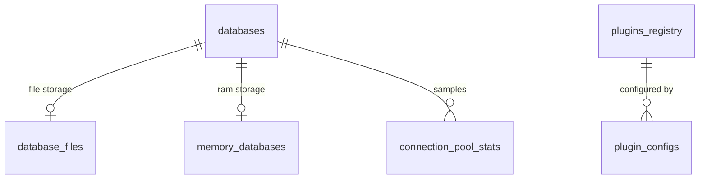

# Entity Relationship Diagram: Core Storage (F3)

## Entities & Attributes (SQLite / bbolt compatible)

### 1. `databases` (registry of attached DBs)
| Column | Type | Constraint | Index |
|--------|------|-----------|-------|
| db_id | TEXT | PK, UUIDv4 | — |
| name | TEXT | NOT NULL, UNIQUE | idx_db_name |
| storage_type | TEXT | NOT NULL ('file'\|'memory') | idx_db_storage |
| status | TEXT | NOT NULL ('attached'\|'detached'\|'error') | — |
| created_at | INTEGER | NOT NULL (unix ms) | idx_db_created |
| updated_at | INTEGER | NOT NULL (unix ms) | — |
| owner_id | TEXT | NOT NULL (FK -> auth) | idx_db_owner |

### 2. `database_files` (1:1 with file-type databases)
| Column | Type | Constraint | Index |
|--------|------|-----------|-------|
| db_id | TEXT | PK, FK -> databases.db_id | — |
| path | TEXT | NOT NULL | idx_df_path |
| size_bytes | INTEGER | NOT NULL DEFAULT 0 | — |
| checksum | TEXT | NOT NULL (sha256) | — |
| wal_enabled | INTEGER | NOT NULL DEFAULT 1 | — |
| last_checked_at | INTEGER | NOT NULL | — |

### 3. `memory_databases` (1:1 with memory-type databases)
| Column | Type | Constraint | Index |
|--------|------|-----------|-------|
| db_id | TEXT | PK, FK -> databases.db_id | — |
| max_memory_bytes | INTEGER | NOT NULL | — |
| used_memory_bytes | INTEGER | NOT NULL DEFAULT 0 | — |
| row_count | INTEGER | NOT NULL DEFAULT 0 | — |
| persistence | INTEGER | NOT NULL DEFAULT 0 (0=none) | — |

### 4. `connection_pool_stats` (N:1 to databases)
| Column | Type | Constraint | Index |
|--------|------|-----------|-------|
| stat_id | TEXT | PK, UUIDv4 | — |
| db_id | TEXT | NOT NULL, FK -> databases.db_id | idx_cps_db |
| active_conns | INTEGER | NOT NULL DEFAULT 0 | — |
| idle_conns | INTEGER | NOT NULL DEFAULT 0 | — |
| max_conns | INTEGER | NOT NULL | — |
| min_conns | INTEGER | NOT NULL | — |
| wait_count | INTEGER | NOT NULL DEFAULT 0 | — |
| avg_wait_ms | REAL | NOT NULL DEFAULT 0 | — |
| sampled_at | INTEGER | NOT NULL (unix ms) | idx_cps_sampled |

### 5. `plugins_registry` (catalog of available plugins)
| Column | Type | Constraint | Index |
|--------|------|-----------|-------|
| plugin_id | TEXT | PK, UUIDv4 | — |
| name | TEXT | NOT NULL, UNIQUE | idx_pl_name |
| type | TEXT | NOT NULL ('export'\|'dialect') | idx_pl_type |
| version | TEXT | NOT NULL | — |
| entrypoint | TEXT | NOT NULL | — |
| enabled | INTEGER | NOT NULL DEFAULT 0 | idx_pl_enabled |
| loaded_at | INTEGER | NULL | — |

### 6. `plugin_configs` (N:1 to plugins_registry)
| Column | Type | Constraint | Index |
|--------|------|-----------|-------|
| config_id | TEXT | PK, UUIDv4 | — |
| plugin_id | TEXT | NOT NULL, FK -> plugins_registry.plugin_id | idx_pc_plugin |
| key | TEXT | NOT NULL | idx_pc_key |
| value | TEXT | NULL | — |
| updated_at | INTEGER | NOT NULL | — |

## Relationships & Cardinality
- `databases` 1:1 `database_files` (storage_type='file' only)
- `databases` 1:1 `memory_databases` (storage_type='memory' only)
- `databases` 1:N `connection_pool_stats` (time-series samples)
- `plugins_registry` 1:N `plugin_configs`
- `databases` 0:N (decoupled; plugins map to DBs at runtime via config)

## Diagrams (Mermaid)

