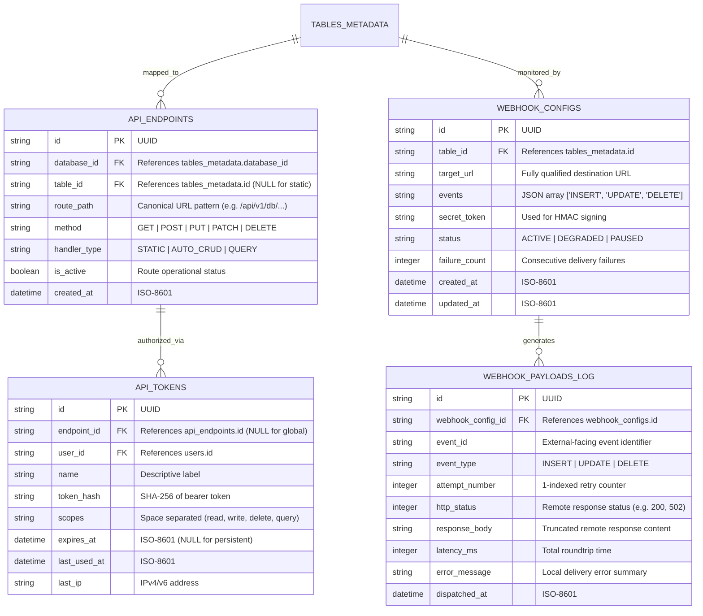

# Entity Relationship Diagram (ERD): REST API & Integration (F5)

## 1. Visual Schema Diagram

---

## 2. Entity Definitions & Production Attributes

### Entity: `api_endpoints`
Dynamic registry of all exposed HTTP routes.
- `id`: TEXT (UUID), PRIMARY KEY.
- `database_id`: TEXT (UUID), NOT NULL. Logical association for db-specific routes.
- `table_id`: TEXT (UUID), NULLABLE. Links to `tables_metadata(id)` for auto-generated CRUD.
- `route_path`: TEXT, NOT NULL. The exact URI suffix (e.g., `/v1/db/prod/tables/users/records`).
- `method`: TEXT, NOT NULL. Restricted to `GET`, `POST`, `PUT`, `PATCH`, `DELETE`, `OPTIONS`.
- `handler_type`: TEXT, NOT NULL. Enum: `STATIC`, `AUTO_CRUD`, `QUERY`.
- `is_active`: BOOLEAN, NOT NULL, DEFAULT TRUE.
- `created_at`: DATETIME, NOT NULL.
- *Indexes*: `idx_endpoints_route_method` UNIQUE ON (`route_path`, `method`).

### Entity: `api_tokens`
Programmatic access credentials.
- `id`: TEXT (UUID), PRIMARY KEY.
- `endpoint_id`: TEXT (UUID), NULLABLE. Links to `api_endpoints(id)`. If NULL, token is global per user.
- `user_id`: TEXT (UUID), NOT NULL. The owner of the token.
- `name`: TEXT, NOT NULL. User-defined label (e.g., "Grafana-Read-Only").
- `token_hash`: TEXT, NOT NULL. SHA-256 hash of the bearer token provided to client.
- `scopes`: TEXT, NOT NULL. Comma-separated or JSON list of permission flags.
- `expires_at`: DATETIME, NULLABLE. Token becomes invalid after this point.
- `last_used_at`: DATETIME, NULLABLE. Tracked on every successful auth.
- `last_ip`: TEXT, NULLABLE. IP of the last successful request.
- *Indexes*: `idx_tokens_hash` UNIQUE ON (`token_hash`).

### Entity: `webhook_configs`
Subscription registry for external event notifications.
- `id`: TEXT (UUID), PRIMARY KEY.
- `table_id`: TEXT (UUID), NOT NULL. FOREIGN KEY to `tables_metadata(id)`.
- `target_url`: TEXT, NOT NULL. Must pass URL validation (protocol + host).
- `events`: TEXT (JSON), NOT NULL. Array of supported event types (INSERT, UPDATE, DELETE).
- `secret_token`: TEXT, NOT NULL. Used as HMAC key for payload signing.
- `status`: TEXT, NOT NULL. DEFAULT 'ACTIVE'. Enum: 'ACTIVE', 'DEGRADED', 'PAUSED'.
- `failure_count`: INTEGER, NOT NULL, DEFAULT 0. Increments on errors; resets on success.
- `created_at`: DATETIME, NOT NULL.
- `updated_at`: DATETIME, NOT NULL.
- *Indexes*: `idx_webhooks_table` ON (`table_id`).

### Entity: `webhook_payloads_log`
Historical audit trail of delivery attempts.
- `id`: TEXT (UUID), PRIMARY KEY.
- `webhook_config_id`: TEXT (UUID), NOT NULL. FOREIGN KEY to `webhook_configs(id)` ON DELETE CASCADE.
- `event_id`: TEXT, NOT NULL. UUID or ULID used in the payload and headers.
- `event_type`: TEXT, NOT NULL. One of the triggered events.
- `attempt_number`: INTEGER, NOT NULL, DEFAULT 1.
- `http_status`: INTEGER, NULLABLE. Result from the target URL.
- `response_body`: TEXT, NULLABLE. Snippet of the response (e.g., first 1KB).
- `latency_ms`: INTEGER, NULLABLE.
- `error_message`: TEXT, NULLABLE. Internal error (e.g., "timeout", "DNS failed").
- `dispatched_at`: DATETIME, NOT NULL.
- *Indexes*: `idx_logs_webhook_id` ON (`webhook_config_id`), `idx_logs_event` ON (`event_id`).
- *Constraints*: CHECK `attempt_number` > 0.
