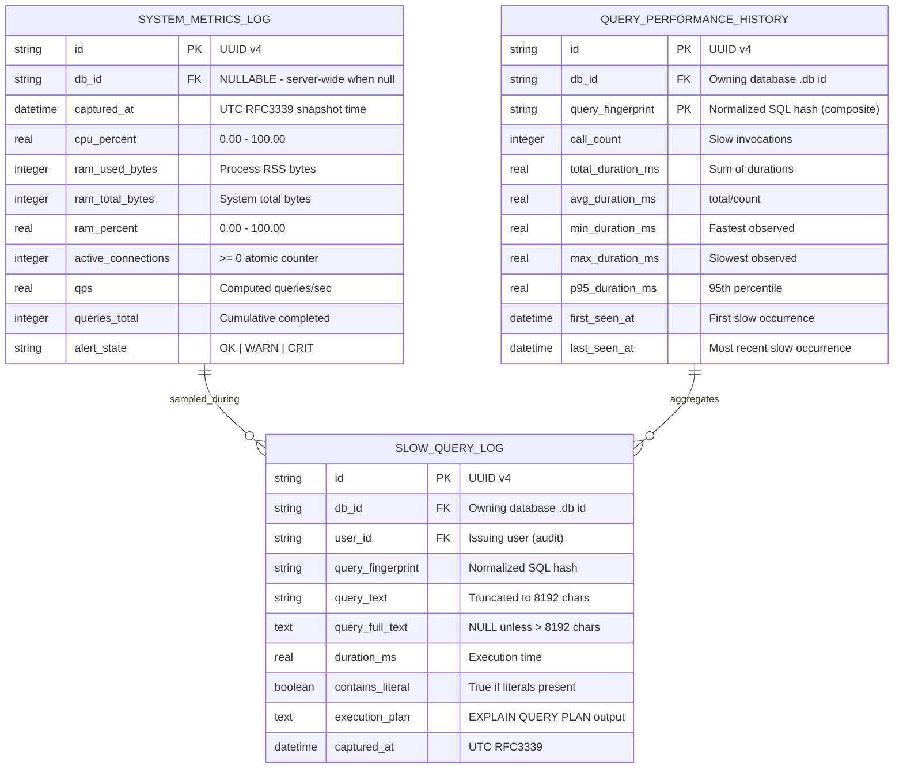

# Entity Relationship Diagram (ERD): Observability (F6)

## 1. Visual Schema Diagram

## 2. Entity Definitions & Production Attributes

### Entity: `system_metrics_log`
Timestamped per-interval snapshots of host/server telemetry. One row per sampling tick.
- `id`: TEXT (UUID v4), PRIMARY KEY.
- `db_id`: TEXT (UUID), NULLABLE. FK to owning database instance; `NULL` = server-wide aggregate.
- `captured_at`: DATETIME (UTC RFC3339), NOT NULL. Snapshot time.
- `cpu_percent`: REAL, NOT NULL, CHECK (`cpu_percent` BETWEEN 0 AND 100).
- `ram_used_bytes`: INTEGER, NOT NULL, CHECK (`ram_used_bytes` >= 0).
- `ram_total_bytes`: INTEGER, NOT NULL, CHECK (`ram_total_bytes` > 0).
- `ram_percent`: REAL, NOT NULL, CHECK (`ram_percent` BETWEEN 0 AND 100).
- `active_connections`: INTEGER, NOT NULL, DEFAULT 0, CHECK (`active_connections` >= 0).
- `qps`: REAL, NOT NULL, DEFAULT 0, CHECK (`qps` >= 0).
- `queries_total`: INTEGER, NOT NULL, DEFAULT 0, CHECK (`queries_total` >= 0).
- `alert_state`: TEXT, NOT NULL, DEFAULT 'OK', CHECK (`alert_state` IN ('OK','WARN','CRIT')).
- **Indexes**:
  - `idx_metrics_captured` ON (`captured_at` DESC) — time-range scans & pruning.
  - `idx_metrics_db_time` ON (`db_id`, `captured_at` DESC) — per-db dashboard queries.
- **Constraints**: Partitioned/pruned by `captured_at` (OBS-014).

### Entity: `slow_query_log`
Per-occurrence record of queries exceeding the slow threshold, including execution plan.
- `id`: TEXT (UUID v4), PRIMARY KEY.
- `db_id`: TEXT (UUID), NOT NULL. FK to owning database instance (tenant-scoped).
- `user_id`: TEXT (UUID), NOT NULL. FK to issuing user (audit trail, F4).
- `query_fingerprint`: TEXT, NOT NULL. Normalized SQL (literals stripped, whitespace collapsed), SHA-256 hex. Aggregation key.
- `query_text`: TEXT, NOT NULL. Original SQL truncated to 8192 chars.
- `query_full_text`: TEXT, NULLABLE. Full SQL when original exceeds 8192 chars.
- `duration_ms`: REAL, NOT NULL, CHECK (`duration_ms` >= 0).
- `contains_literal`: BOOLEAN, NOT NULL, DEFAULT FALSE.
- `execution_plan`: TEXT, NOT NULL. `EXPLAIN QUERY PLAN` output; `PLAN_UNAVAILABLE` on failure.
- `captured_at`: DATETIME (UTC RFC3339), NOT NULL.
- **Indexes**:
  - `idx_slow_captured` ON (`captured_at` DESC) — time filtering (OBS-013).
  - `idx_slow_db_time` ON (`db_id`, `captured_at` DESC) — tenant-scoped listing.
  - `idx_slow_duration` ON (`duration_ms` DESC) — top-N slowest queries.
  - `idx_slow_fingerprint` ON (`query_fingerprint`) — join to history (OBS-012).
- **Constraints**: FK `db_id` → database catalog ON DELETE CASCADE; FK `user_id` → users ON DELETE SET NULL.

### Entity: `query_performance_history`
Materialized per-fingerprint aggregates of slow-query behavior (rolling statistics).
- `id`: TEXT (UUID v4), PRIMARY KEY.
- `db_id`: TEXT (UUID), NOT NULL. FK to owning database instance.
- `query_fingerprint`: TEXT, NOT NULL. Composite PK with `db_id`.
- `call_count`: INTEGER, NOT NULL, DEFAULT 0, CHECK (`call_count` >= 0).
- `total_duration_ms`: REAL, NOT NULL, DEFAULT 0.
- `avg_duration_ms`: REAL, NOT NULL, DEFAULT 0.
- `min_duration_ms`: REAL, NOT NULL.
- `max_duration_ms`: REAL, NOT NULL.
- `p95_duration_ms`: REAL, NOT NULL, DEFAULT 0.
- `first_seen_at`: DATETIME (UTC), NOT NULL.
- `last_seen_at`: DATETIME (UTC), NOT NULL.
- **Primary Key**: COMPOSITE (`db_id`, `query_fingerprint`).
- **Indexes**:
  - `idx_hist_db_fingerprint` UNIQUE ON (`db_id`, `query_fingerprint`) — upsert target.
  - `idx_hist_last_seen` ON (`last_seen_at` DESC).
- **Relationships**:
  - `query_performance_history` (1) —— (N) `slow_query_log`: each fingerprint aggregates many slow-query occurrences via `query_fingerprint`. Cardinality **1:N**.
  - `slow_query_log.query_fingerprint` → `query_performance_history.query_fingerprint` (many-to-one).
- **Constraints**: Upsert (`INSERT ... ON CONFLICT(db_id,query_fingerprint) DO UPDATE`) on each slow-query write (OBS-012).

## 3. Relationship & Cardinality Summary

| Relationship | Type | Cardinality | On Delete |
| :--- | :--- | :--- | :--- |
| `system_metrics_log` → `slow_query_log` | contextual (sampled_during) | 1 : N (loose) | independent |
| `query_performance_history` → `slow_query_log` | aggregates (by fingerprint) | 1 : N | CASCADE log rows |
| `slow_query_log.db_id` → database catalog | ownership | N : 1 | CASCADE |
| `slow_query_log.user_id` → users | audit | N : 1 | SET NULL |

Notes:
- `system_metrics_log` is server-level and stands independent; it correlates to `slow_query_log` only by shared `captured_at` window (no hard FK).
- `query_performance_history` is derived (materialized) from `slow_query_log`; it is never inserted directly by clients.
- All timestamps stored UTC; retention enforced by OBS-014 pruning job.
